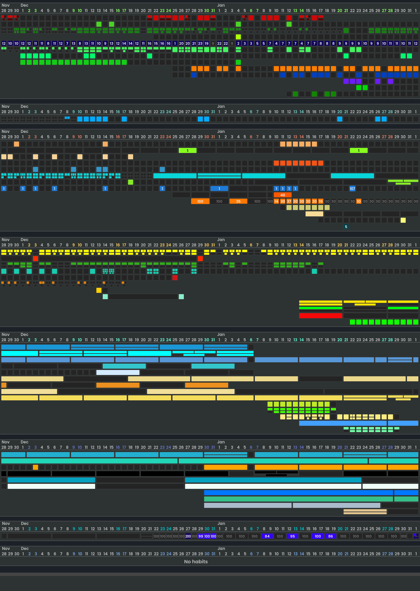

<h1 align="center">
  <picture>
    <source media="(prefers-color-scheme: dark)" srcset="frontend/src/logos/neohabit-header-readme-dark.svg" width="1000px" />
    
  </picture>
</h1>

  <a href="#installation">Install</a> •
  <a href="#github-pages">Features preview</a> •
  <a href="#donations">Donations</a>

A highly customizable habit-tracker  that is wired for systematic self-improvement 

## Installation

TODO

## Donations

BTC: bc1qkt9xge2a8h3zt65ju7qkyvh6z6qjn6kdz8tm4a

XMR: 48F86e1vigUU8jUSf3kBYNJhMGp38dKxqBhga9sLz1Lr5qM8QqXrY3g4X8uQyqh7wQKhm7MpxSsSpdp1PGvY96jh1MGwyx8

To anyone who's kind enough to donate, thank you! Neohabit's development has
cost me more than I'm comfortable admitting, if not financially then just in time
alone. Spreading the word and mentioning this project to your friends is also
welcome and much appreciated.
